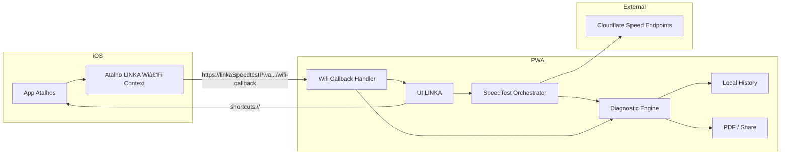

# LINKA SpeedTest — Feature: Contexto Wi‑Fi via Atalho iOS

## 1. Resumo executivo

A feature **Contexto Wi‑Fi via Atalho iOS** permite complementar o resultado do LINKA SpeedTest com informações locais da rede Wi‑Fi do iPhone, coletadas por um Atalho do app Atalhos do iOS.

O objetivo não é substituir o teste de velocidade do LINKA. O objetivo é enriquecer o diagnóstico com dados que o PWA, sozinho, não consegue obter de forma confiável no iOS, como SSID, BSSID, canal, RSSI, ruído, padrão Wi‑Fi e taxas de link RX/TX.

Com isso, o LINKA consegue separar melhor três cenários comuns:

- internet ruim;
- Wi‑Fi local ruim;
- internet aparentemente boa, mas experiência ruim por latência, oscilação ou perda.

A feature deve ser transparente para o usuário, sem coleta invisível, sem automação silenciosa e sem exposição desnecessária de dados sensíveis.

---

## 2. Problema

O LINKA SpeedTest mede a experiência real do aparelho/navegador até a internet, usando endpoints externos. Isso é correto para medir navegação, streaming, chamadas, jogos e trabalho remoto.

Porém, em iPhone/PWA, o navegador não expõe de forma confiável dados locais do Wi‑Fi. Isso limita o diagnóstico, porque um teste ruim pode ser causado por:

- sinal Wi‑Fi fraco;
- usuário longe do roteador;
- rede em 2.4 GHz congestionada;
- canal ruim;
- baixa taxa de link;
- instabilidade local;
- problema real da operadora;
- saturação da rede doméstica;
- limitação do aparelho.

Sem contexto Wi‑Fi, o app pode acertar a medição, mas errar a explicação.

---

## 3. Objetivo da feature

Permitir que usuários de iPhone rodem um Atalho iOS complementar antes do speedtest para coletar dados locais do Wi‑Fi e devolver esses dados ao PWA LINKA.

O PWA deve então usar esses dados para:

- exibir contexto do Wi‑Fi no resultado;
- enriquecer o diagnóstico final;
- sugerir ações práticas;
- diferenciar problema de Wi‑Fi de problema de internet;
- registrar os dados no histórico local do teste;
- permitir exportação controlada, com ocultação de dados sensíveis por padrão.

---

## 4. Não objetivos

Esta feature não pretende:

- medir velocidade entre iPhone e roteador;
- medir throughput LAN real;
- medir sinal GPON/fibra;
- acessar dados administrativos do roteador;
- substituir ferramentas como iperf3;
- rodar automaticamente sem ação do usuário;
- coletar dados em segundo plano;
- prometer prova regulatória contra operadora;
- expor IP, BSSID ou identificadores sensíveis em relatórios públicos por padrão.

---

## 5. Público-alvo

### Usuário final

Pessoa comum que quer saber se a internet serve para:

- jogos online;
- streaming 4K;
- videochamadas;
- home office;
- navegação geral.

Esse usuário não deve ser exposto a termos técnicos brutos como “RSSI”, “jitter”, “BSSID” e “TX Rate” sem tradução.

### Usuário técnico

Pessoa que quer ver detalhes avançados do teste, útil para suporte, instalação, diagnóstico doméstico ou comparação entre cômodos.

Para esse usuário, o app pode oferecer um bloco “Detalhes avançados”.

---

## 6. Visão funcional

### Fluxo principal

1. Usuário abre o LINKA SpeedTest no iPhone.
2. O app detecta ambiente iOS/PWA.
3. O app exibe a opção: **Medir com contexto Wi‑Fi do iPhone**.
4. Usuário toca no botão.
5. O PWA chama o deep link do app Atalhos.
6. O Atalho LINKA Wi‑Fi Context é executado.
7. O Atalho coleta os dados locais da rede Wi‑Fi.
8. O Atalho abre de volta o PWA com os dados codificados na URL.
9. O PWA valida e salva temporariamente o contexto Wi‑Fi.
10. O PWA inicia o speedtest ou oferece botão para iniciar.
11. Ao final, o resultado une:
    - métricas do speedtest;
    - contexto Wi‑Fi;
    - diagnóstico combinado;
    - recomendações práticas.

---

## 7. Experiência do usuário

### 7.1 Tela inicial

Quando o app estiver em iOS, exibir dois caminhos:

```txt
Iniciar teste
```

```txt
Medir com contexto Wi‑Fi do iPhone
```

Texto de apoio:

```txt
O contexto Wi‑Fi ajuda a diferenciar problema de sinal do Wi‑Fi de problema da internet.
```

### 7.2 Usuário sem atalho instalado

Se o usuário tocar no botão e o atalho não existir, o iOS pode não executar nada ou abrir o app Atalhos sem resultado útil.

O PWA deve mostrar uma tela de instrução antes da primeira tentativa:

```txt
Para medir também o sinal Wi‑Fi do iPhone, instale o atalho LINKA Wi‑Fi Context.
Depois volte aqui e toque novamente em “Medir com contexto Wi‑Fi”.
```

Deve haver botão:

```txt
Instalar atalho
```

E outro:

```txt
Continuar sem contexto Wi‑Fi
```

### 7.3 Retorno com sucesso

Quando o PWA receber os dados do atalho, exibir confirmação discreta:

```txt
Contexto Wi‑Fi recebido.
Agora vamos medir sua conexão.
```

### 7.4 Retorno incompleto

Se alguns campos vierem ausentes:

```txt
Recebemos parte dos dados do Wi‑Fi. O teste continuará normalmente.
```

### 7.5 Falha ou cancelamento

Se o usuário cancelar o atalho ou voltar manualmente:

```txt
Não foi possível coletar o contexto Wi‑Fi.
Você ainda pode fazer o teste normal.
```

---

## 8. Arquitetura geral

```mermaid
flowchart TD
    A[Usuário no PWA LINKA] --> B{Ambiente iOS?}
    B -- Não --> C[Teste normal]
    B -- Sim --> D[Botão: Medir com contexto Wi‑Fi]
    D --> E[Deep link shortcuts://run-shortcut]
    E --> F[Atalho LINKA Wi‑Fi Context]
    F --> G[Coleta dados locais do Wi‑Fi]
    G --> H[Abre returnUrl do PWA com payload]
    H --> I[PWA valida payload]
    I --> J[Salva wifiContext temporário]
    J --> K[Executa LINKA SpeedTest]
    K --> L[Combina speedtest + wifiContext]
    L --> M[Resultado e diagnóstico]
    M --> N[Histórico local]
    M --> O[PDF/Compartilhamento com privacidade]
```



---

## 9. Arquitetura em camadas



---

## 10. Componentes envolvidos

### 10.1 PWA LINKA

Responsável por:

- detectar se o usuário está em iOS;
- exibir CTA de contexto Wi‑Fi;
- abrir o atalho via deep link;
- receber retorno por URL;
- validar o payload;
- persistir contexto temporário;
- iniciar teste;
- cruzar dados Wi‑Fi com speedtest;
- mostrar diagnóstico combinado;
- salvar histórico;
- exportar relatório respeitando privacidade.

### 10.2 Atalho iOS LINKA Wi‑Fi Context

Responsável por:

- receber `returnUrl` e `sessionId` do PWA;
- coletar dados de rede via ações do app Atalhos;
- montar payload de retorno;
- abrir o PWA novamente com os dados.

### 10.3 Motor de speedtest

Responsável por:

- latência descarregada;
- download;
- upload;
- latência durante download;
- latência durante upload;
- bufferbloat;
- estabilidade;
- DNS;
- perda/falhas estimadas ou nativas quando disponíveis.

### 10.4 Motor de diagnóstico

Responsável por combinar:

- velocidade medida;
- latência;
- oscilação;
- perda/falha;
- estabilidade;
- tipo de conexão;
- contexto Wi‑Fi local;
- perfil de uso do usuário.

---

## 11. Contrato de dados

### 11.1 Payload enviado do PWA para o Atalho

O PWA deve abrir o Atalho passando um JSON simples no parâmetro `text`.

Exemplo:

```json
{
  "version": 1,
  "sessionId": "st_1730000000000_ab12cd",
  "returnUrl": "https://linkaSpeedtestPwa.pages.dev/wifi-callback",
  "startedAt": 1730000000000,
  "source": "linka-pwa"
}
```

### 11.2 Deep link para rodar o Atalho

Formato:

```txt
shortcuts://run-shortcut?name=LINKA%20WiFi%20Context&input=text&text=<payload-encoded>
```

Exemplo em TypeScript:

```ts
const payload = encodeURIComponent(JSON.stringify({
  version: 1,
  sessionId,
  returnUrl: `${window.location.origin}/wifi-callback`,
  startedAt: Date.now(),
  source: 'linka-pwa',
}));

window.location.href =
  `shortcuts://run-shortcut?name=LINKA%20WiFi%20Context&input=text&text=${payload}`;
```

### 11.3 Payload retornado pelo Atalho ao PWA

Opção recomendada: retornar via query string com payload compactado em Base64 URL-safe.

URL:

```txt
https://linkaSpeedtestPwa.pages.dev/wifi-callback?ctx=<base64url-json>
```

JSON interno:

```json
{
  "version": 1,
  "sessionId": "st_1730000000000_ab12cd",
  "collectedAt": 1730000008123,
  "platform": "ios-shortcut",
  "wifi": {
    "available": true,
    "ssid": "Minha Rede",
    "bssid": "aa:bb:cc:dd:ee:ff",
    "rssiDbm": -67,
    "noiseDbm": -91,
    "snrDb": 24,
    "channel": 149,
    "txRateMbps": 286,
    "rxRateMbps": 344,
    "wifiStandard": "802.11ax",
    "localIp": "192.168.1.42"
  }
}
```

### 11.4 Fallback simples por query string

Se Base64 for difícil no Atalho, usar query string explícita:

```txt
/wifi-callback?sid=st_123&rssi=-67&noise=-91&tx=286&rx=344&channel=149&standard=802.11ax
```

Menos elegante, mas mais fácil de montar no app Atalhos.

---

## 12. Modelo de dados no PWA

### 12.1 Tipo TypeScript sugerido

```ts
export type WifiContextSource = 'ios-shortcut' | 'android-native' | 'manual' | 'unknown';

export interface WifiContext {
  version: number;
  source: WifiContextSource;
  sessionId: string;
  collectedAt: number;
  available: boolean;

  ssid?: string;
  bssid?: string;
  rssiDbm?: number;
  noiseDbm?: number;
  snrDb?: number;
  channel?: number;
  txRateMbps?: number;
  rxRateMbps?: number;
  linkSpeedMbps?: number;
  wifiStandard?: string;
  localIp?: string;

  privacy: {
    sensitiveFieldsPresent: boolean;
    hideSensitiveByDefault: boolean;
  };
}
```

### 12.2 Integração com resultado do speedtest

Adicionar ao `SpeedTestResult`:

```ts
export interface SpeedTestResult {
  dl: number;
  ul: number;
  latency: number;
  jitter: number;
  packetLoss: number;
  timestamp: number;
  mode: 'fast' | 'complete';

  wifiContext?: WifiContext;
  diagnostics: Diagnostic[];
}
```

---

## 13. Validação do payload

O PWA deve validar:

- `version` suportada;
- `sessionId` igual ao esperado, quando existir;
- `collectedAt` recente;
- campos numéricos dentro de faixas plausíveis;
- ausência de caracteres perigosos em strings;
- tamanho máximo do payload;
- origem esperada da rota de callback.

### 13.1 Faixas sugeridas

```ts
const WIFI_LIMITS = {
  rssiDbm: { min: -100, max: -20 },
  noiseDbm: { min: -120, max: -20 },
  snrDb: { min: 0, max: 80 },
  channel: { min: 1, max: 233 },
  txRateMbps: { min: 0, max: 10000 },
  rxRateMbps: { min: 0, max: 10000 },
};
```

### 13.2 Expiração

Contexto Wi‑Fi deve expirar rápido.

Recomendação:

```txt
Validade: 2 minutos
```

Motivo: o usuário pode trocar de rede, andar para outro cômodo ou alternar entre Wi‑Fi e dados móveis.

---

## 14. Regras de diagnóstico Wi‑Fi

### 14.1 Classificação por RSSI

```ts
function classifyRssi(rssi?: number) {
  if (rssi == null) return 'unknown';
  if (rssi >= -55) return 'excellent';
  if (rssi >= -67) return 'good';
  if (rssi >= -75) return 'fair';
  if (rssi >= -82) return 'weak';
  return 'critical';
}
```

### 14.2 Classificação por SNR

```ts
function classifySnr(snr?: number) {
  if (snr == null) return 'unknown';
  if (snr >= 35) return 'excellent';
  if (snr >= 25) return 'good';
  if (snr >= 18) return 'fair';
  if (snr >= 10) return 'weak';
  return 'critical';
}
```

### 14.3 Classificação por taxa de link

A taxa de link não deve ser exibida como velocidade real. Ela deve ser chamada de “taxa negociada com o Wi‑Fi” ou “capacidade do link naquele momento”.

```ts
function classifyLinkRate(rate?: number) {
  if (rate == null) return 'unknown';
  if (rate >= 600) return 'excellent';
  if (rate >= 300) return 'good';
  if (rate >= 120) return 'fair';
  if (rate >= 50) return 'weak';
  return 'critical';
}
```

---

## 15. Diagnóstico combinado

### 15.1 Internet ruim + Wi‑Fi ruim

Condição:

- download baixo ou upload baixo;
- RSSI fraco/crítico ou SNR baixo.

Mensagem:

```txt
O teste ficou abaixo do esperado e o sinal Wi‑Fi neste ponto também parece fraco. Antes de culpar a operadora, teste mais perto do roteador.
```

Ação sugerida:

```txt
Aproxime o aparelho do roteador e repita o teste.
```

### 15.2 Internet ruim + Wi‑Fi bom

Condição:

- download/upload baixo;
- RSSI bom/excelente;
- SNR bom/excelente;
- taxa de link razoável.

Mensagem:

```txt
O Wi‑Fi parece adequado neste ponto, mas a velocidade medida ficou baixa. O gargalo pode estar na internet, no roteador, no horário de uso ou na operadora.
```

Ação sugerida:

```txt
Repita o teste em outro horário e, se possível, compare com outro aparelho.
```

### 15.3 Latência ruim + Wi‑Fi ruim

Condição:

- latência alta, jitter alto ou bufferbloat;
- RSSI/SNR ruim.

Mensagem:

```txt
A resposta da conexão ficou instável e o Wi‑Fi também parece fraco. Isso pode afetar jogos, chamadas e reuniões mesmo quando há Mbps suficientes.
```

Ação sugerida:

```txt
Teste mais perto do roteador ou use uma rede de 5 GHz/6 GHz, se disponível.
```

### 15.4 Velocidade boa + Wi‑Fi ruim

Condição:

- download/upload bons;
- RSSI ruim.

Mensagem:

```txt
A velocidade passou, mas o sinal Wi‑Fi está no limite. A conexão pode oscilar em chamadas, jogos ou ao se mover pela casa.
```

Ação sugerida:

```txt
Considere melhorar a cobertura Wi‑Fi nesse ambiente.
```

### 15.5 Wi‑Fi bom + latência sob carga ruim

Condição:

- RSSI bom;
- velocidade boa;
- latência durante download/upload sobe muito.

Mensagem:

```txt
O sinal Wi‑Fi parece bom, mas a resposta piora quando a conexão está em uso. Isso indica possível saturação do roteador ou da conexão.
```

Ação sugerida:

```txt
Evite downloads pesados durante chamadas e jogos, ou avalie um roteador com melhor controle de fila.
```

---

## 16. Linguagem para usuário final

Evitar termos técnicos na superfície principal.

### Preferir

```txt
resposta
oscilação
sinal Wi‑Fi
falhas na conexão
estabilidade
cobertura Wi‑Fi
```

### Evitar na interface principal

```txt
latência
jitter
packet loss
RSSI
SNR
BSSID
TX Rate
RX Rate
bufferbloat
```

Esses termos podem aparecer apenas em “Detalhes avançados”.

---

## 17. UI sugerida no resultado

### 17.1 Card simples

```txt
Contexto Wi‑Fi

Sinal: Bom
Canal: 149
Padrão: Wi‑Fi 6
Taxa negociada: 286 Mbps envio / 344 Mbps recepção

O Wi‑Fi parece adequado neste ponto da casa.
```

### 17.2 Detalhes avançados

```txt
Detalhes avançados

SSID: Minha Rede
BSSID: oculto
RSSI: -67 dBm
Ruído: -91 dBm
SNR: 24 dB
Canal: 149
TX Rate: 286 Mbps
RX Rate: 344 Mbps
Padrão: 802.11ax
IP local: oculto
```

### 17.3 Aviso sobre taxa de link

```txt
A taxa negociada do Wi‑Fi não é a velocidade real da internet. Ela indica a qualidade do link entre o aparelho e o roteador naquele momento.
```

---

## 18. Privacidade e segurança

### 18.1 Dados sensíveis

Tratar como sensíveis:

- BSSID;
- IP local;
- IP público;
- SSID, dependendo do contexto;
- localização aproximada derivada de IP;
- timestamp combinado com identificadores de rede.

### 18.2 Política de exibição

Por padrão:

- mostrar SSID apenas no app local;
- ocultar BSSID;
- ocultar IP local;
- ocultar IP público em PDF/compartilhamento;
- permitir botão “mostrar detalhes avançados”;
- mascarar identificadores.

Exemplo de máscara:

```txt
BSSID: aa:bb:••:••:ee:ff
IP local: 192.168.1.xxx
```

### 18.3 Compartilhamento

Ao compartilhar resultado:

- não incluir BSSID por padrão;
- não incluir IP local por padrão;
- não incluir IP público por padrão;
- incluir apenas diagnóstico textual e métricas principais;
- oferecer opção avançada: “incluir dados técnicos”, desativada por padrão.

### 18.4 Armazenamento

O histórico continua local.

Os dados Wi‑Fi devem ser salvos apenas no histórico local do navegador, sem backend, salvo decisão futura explícita.

---

## 19. Rotas sugeridas

### 19.1 `/`

Tela inicial e teste normal.

### 19.2 `/wifi-callback`

Rota de retorno do Atalho.

Responsabilidades:

- ler query string;
- decodificar payload;
- validar dados;
- salvar `wifiContext` temporário;
- redirecionar para tela de teste ou iniciar medição.

### 19.3 `/shortcut-help`

Tela de instrução para instalar/configurar o Atalho.

### 19.4 `/result/:id`

Resultado com contexto Wi‑Fi, quando disponível.

---

## 20. Implementação no PWA

### 20.1 Detecção de iOS

```ts
export function isIOS(): boolean {
  if (typeof navigator === 'undefined') return false;
  return /iPad|iPhone|iPod/.test(navigator.userAgent)
    || (navigator.platform === 'MacIntel' && navigator.maxTouchPoints > 1);
}
```

### 20.2 Detecção de PWA standalone

```ts
export function isStandalonePwa(): boolean {
  return window.matchMedia('(display-mode: standalone)').matches
    || (window.navigator as any).standalone === true;
}
```

### 20.3 Abrir o Atalho

```ts
export function runWifiShortcut(sessionId: string) {
  const returnUrl = `${window.location.origin}/wifi-callback`;

  const payload = encodeURIComponent(JSON.stringify({
    version: 1,
    sessionId,
    returnUrl,
    startedAt: Date.now(),
    source: 'linka-pwa',
  }));

  const shortcutUrl =
    `shortcuts://run-shortcut?name=LINKA%20WiFi%20Context&input=text&text=${payload}`;

  window.location.href = shortcutUrl;
}
```

### 20.4 Ler retorno

```ts
export function parseWifiCallback(search: string): WifiContext | null {
  const params = new URLSearchParams(search);
  const ctx = params.get('ctx');

  if (ctx) {
    const json = decodeBase64UrlJson(ctx);
    return validateWifiContext(json);
  }

  return validateWifiContext({
    version: 1,
    source: 'ios-shortcut',
    sessionId: params.get('sid'),
    collectedAt: Number(params.get('t')) || Date.now(),
    available: params.get('available') !== 'false',
    rssiDbm: toNumber(params.get('rssi')),
    noiseDbm: toNumber(params.get('noise')),
    snrDb: toNumber(params.get('snr')),
    channel: toNumber(params.get('channel')),
    txRateMbps: toNumber(params.get('tx')),
    rxRateMbps: toNumber(params.get('rx')),
    wifiStandard: params.get('standard') || undefined,
    ssid: params.get('ssid') || undefined,
    bssid: params.get('bssid') || undefined,
    localIp: params.get('localIp') || undefined,
  });
}
```

### 20.5 Salvar temporariamente

```ts
const WIFI_CONTEXT_KEY = 'linka.pendingWifiContext';

export function savePendingWifiContext(ctx: WifiContext) {
  sessionStorage.setItem(WIFI_CONTEXT_KEY, JSON.stringify(ctx));
}

export function consumePendingWifiContext(): WifiContext | null {
  const raw = sessionStorage.getItem(WIFI_CONTEXT_KEY);
  if (!raw) return null;
  sessionStorage.removeItem(WIFI_CONTEXT_KEY);

  try {
    const ctx = JSON.parse(raw) as WifiContext;
    if (Date.now() - ctx.collectedAt > 2 * 60 * 1000) return null;
    return ctx;
  } catch {
    return null;
  }
}
```

---

## 21. Implementação do Atalho iOS

### 21.1 Nome do Atalho

```txt
LINKA WiFi Context
```

O nome deve ser estável, pois será chamado pelo deep link.

### 21.2 Entrada

O Atalho deve receber texto contendo JSON.

Campos esperados:

- `version`;
- `sessionId`;
- `returnUrl`;
- `startedAt`;
- `source`.

### 21.3 Ações principais no Atalho

Fluxo sugerido:

```txt
1. Receber entrada do atalho
2. Obter texto da entrada
3. Extrair JSON ou tratar como texto
4. Obter returnUrl
5. Obter sessionId
6. Get Network Details → Network Name
7. Get Network Details → BSSID
8. Get Network Details → Wi‑Fi Standard
9. Get Network Details → RSSI
10. Get Network Details → Noise
11. Calcular SNR = RSSI - Noise
12. Get Network Details → Channel Number
13. Get Network Details → TX Rate
14. Get Network Details → RX Rate
15. Get Network Details → Local IP Address, se disponível
16. Montar payload
17. Codificar payload ou montar query string
18. Abrir URL de retorno
```

### 21.4 Retorno simples recomendado para primeira versão

Para reduzir dificuldade no Atalho, usar query string simples na V1:

```txt
returnUrl
  ?sid=<sessionId>
  &t=<timestamp>
  &ssid=<ssid>
  &bssid=<bssid>
  &rssi=<rssi>
  &noise=<noise>
  &snr=<snr>
  &channel=<channel>
  &tx=<txRate>
  &rx=<rxRate>
  &standard=<wifiStandard>
  &localIp=<localIp>
```

Na V2, migrar para `ctx=<base64url-json>`.

---

## 22. Estados de erro

### 22.1 Atalho não instalado

Sintoma:

- deep link não retorna;
- usuário permanece no app Atalhos;
- usuário volta sem contexto.

Tratamento:

- oferecer teste normal;
- manter instrução de instalação;
- não bloquear o produto.

### 22.2 Dados ausentes

Sintoma:

- iOS não retorna campo específico;
- usuário não está em Wi‑Fi;
- ação do Atalho falha.

Tratamento:

- preencher apenas campos disponíveis;
- `available=false` se nenhum dado útil foi coletado;
- continuar teste normal.

### 22.3 Dados expirados

Sintoma:

- callback antigo aberto depois;
- usuário alternou rede.

Tratamento:

- descartar contexto se passou de 2 minutos;
- exibir aviso.

### 22.4 Retorno abre Safari em vez do PWA

Sintoma:

- iOS abre o domínio no Safari.

Tratamento:

- app deve funcionar normalmente no Safari;
- não depender exclusivamente de estado em memória;
- usar query string e sessionStorage/localStorage;
- manter UX tolerante.

---

## 23. Histórico

Adicionar `wifiContext` ao histórico local.

No histórico, exibir resumo:

```txt
Wi‑Fi: Bom sinal • Canal 149 • Wi‑Fi 6
```

Em detalhes do histórico:

```txt
Sinal: -67 dBm
Ruído: -91 dBm
SNR: 24 dB
Taxa negociada: 286/344 Mbps
```

Dados sensíveis devem continuar ocultos por padrão.

---

## 24. Exportação PDF

### 24.1 PDF padrão

Incluir:

- diagnóstico final;
- download;
- upload;
- resposta;
- oscilação;
- estabilidade;
- resumo Wi‑Fi sem identificadores sensíveis.

Não incluir por padrão:

- BSSID;
- IP local;
- IP público;
- SSID completo, caso o usuário escolha ocultar.

### 24.2 PDF técnico

Permitir opção:

```txt
Incluir detalhes técnicos do Wi‑Fi
```

Deve vir desligada por padrão.

---

## 25. Compatibilidade

### 25.1 iOS

Fluxo principal via Atalho.

Requisitos:

- usuário precisa instalar o Atalho;
- usuário precisa tocar no botão;
- retorno via URL;
- sem execução silenciosa.

### 25.2 Android PWA

Sem Atalho.

Usar fluxo atual de detecção web quando disponível.

### 25.3 Android APK / Capacitor

Usar bridge nativa existente ou futura para coletar dados locais.

A arquitetura deve tentar unificar tudo em `WifiContext`, independentemente da origem:

```txt
ios-shortcut
android-native
manual
unknown
```

### 25.4 Desktop

Não exibir CTA de Atalho iOS.

---

## 26. Plano de implementação

### Fase 1 — MVP funcional

1. Criar rota `/wifi-callback`.
2. Criar tipo `WifiContext`.
3. Criar parser de query string simples.
4. Criar botão no PWA para abrir Atalho.
5. Criar Atalho iOS V1 com query string simples.
6. Salvar contexto em sessionStorage.
7. Anexar `wifiContext` ao próximo resultado.
8. Exibir card simples no resultado.

### Fase 2 — Diagnóstico combinado

1. Criar classificador Wi‑Fi.
2. Criar regras cruzando Wi‑Fi + speedtest.
3. Ajustar textos para usuário final.
4. Criar detalhes avançados.
5. Adicionar contexto ao histórico.

### Fase 3 — Privacidade e exportação

1. Mascarar BSSID/IP.
2. Atualizar PDF.
3. Atualizar compartilhamento.
4. Criar opção “incluir dados técnicos”.
5. Revisar textos de privacidade.

### Fase 4 — Robustez

1. Migrar retorno para `ctx=base64url-json`.
2. Adicionar validação forte.
3. Adicionar expiração.
4. Criar testes unitários.
5. Testar iOS Safari e PWA instalado.
6. Testar cancelamento e atalho ausente.

---

## 27. Critérios de aceite

### Funcionais

- Usuário em iOS vê opção de medir com contexto Wi‑Fi.
- Botão abre o Atalho instalado.
- Atalho coleta dados disponíveis da rede.
- Atalho retorna ao PWA com dados.
- PWA valida e salva contexto.
- Resultado mostra bloco de contexto Wi‑Fi.
- Teste normal continua funcionando sem Atalho.
- Cancelamento não quebra o app.
- Histórico registra resumo Wi‑Fi quando disponível.
- PDF não expõe BSSID/IP por padrão.

### Técnicos

- Parser ignora dados inválidos.
- Payload expira após tempo definido.
- Campos sensíveis são mascarados.
- Código não depende de estado em memória após retorno.
- Feature não quebra Android, desktop ou PWA normal.
- Testes cobrem parsing, validação e classificação Wi‑Fi.

### UX

- Usuário entende que o Atalho é opcional.
- Usuário entende que taxa Wi‑Fi não é velocidade real da internet.
- Mensagens evitam tecnicês na visão principal.
- Detalhes técnicos ficam acessíveis, mas não dominam a tela.

---

## 28. Testes sugeridos

### 28.1 Testes unitários

- `parseWifiCallback()` com payload completo.
- `parseWifiCallback()` com campos faltando.
- `parseWifiCallback()` com valores fora da faixa.
- `validateWifiContext()` com payload expirado.
- `classifyRssi()`.
- `classifySnr()`.
- `classifyLinkRate()`.
- regras de diagnóstico combinado.

### 28.2 Testes manuais iOS

- iPhone em Wi‑Fi 2.4 GHz.
- iPhone em Wi‑Fi 5 GHz.
- iPhone longe do roteador.
- iPhone perto do roteador.
- iPhone em dados móveis.
- Atalho instalado.
- Atalho ausente.
- Atalho cancelado.
- PWA instalado.
- Safari normal.
- retorno abrindo Safari em vez do PWA.

### 28.3 Testes de privacidade

- PDF padrão sem IP/BSSID.
- Compartilhamento sem IP/BSSID.
- Histórico local com detalhes ocultos.
- Botão de detalhes técnicos funcionando.

---

## 29. Riscos e mitigação

### Risco: Atalho não instalado

Mitigação:

- feature opcional;
- tela de instalação;
- teste normal sempre disponível.

### Risco: iOS muda comportamento do deep link

Mitigação:

- fluxo tolerante;
- fallback manual;
- não tornar o Atalho obrigatório.

### Risco: retorno abre no Safari

Mitigação:

- callback por URL completa;
- app funcional fora do standalone;
- estado persistido via URL/sessionStorage.

### Risco: usuário interpreta TX/RX como velocidade contratada

Mitigação:

- texto claro;
- chamar de “taxa negociada do Wi‑Fi”;
- explicar que não é velocidade real da internet.

### Risco: exposição de identificadores

Mitigação:

- ocultar por padrão;
- mascarar;
- opção avançada desligada.

---

## 30. Roadmap futuro

### 30.1 Comparação por ambiente

Permitir nomear local do teste:

```txt
Sala
Quarto
Escritório
Perto do roteador
```

Com isso, o usuário consegue comparar cobertura Wi‑Fi por cômodo.

### 30.2 Relatório de cobertura simples

Gerar resumo:

```txt
O quarto apresentou sinal fraco e menor estabilidade que a sala.
```

### 30.3 QR Code do Atalho

Gerar QR Code ou link curto para instalar o Atalho LINKA.

### 30.4 Modo suporte técnico

Criar modo com mais detalhes para técnicos:

- BSSID mascarado;
- canal;
- banda inferida;
- taxa de link;
- RSSI/SNR;
- horário;
- comparação com teste anterior.

### 30.5 Integração nativa iOS futura

Caso o LINKA vire app nativo iOS, substituir o Atalho por coleta nativa via APIs permitidas.

---

## 31. Decisão recomendada

Implementar a feature como complemento opcional, com fluxo assistido pelo usuário.

Não tentar executar o Atalho automaticamente de forma invisível.

Não tentar transformar o Atalho em speedtest paralelo.

O Atalho deve coletar somente o contexto local do Wi‑Fi. O LINKA continua responsável por medir velocidade, estabilidade, resposta e diagnóstico.

Essa separação deixa a arquitetura mais limpa, reduz risco técnico e melhora a explicação para o usuário final.

---

## 32. Nome sugerido da feature

Opções:

- **Contexto Wi‑Fi**
- **Diagnóstico Wi‑Fi do iPhone**
- **Prova de Wi‑Fi**
- **LINKA Wi‑Fi Context**
- **Teste com contexto Wi‑Fi**

Recomendação:

```txt
Teste com contexto Wi‑Fi
```

Motivo: é claro para usuário comum e não promete mais do que entrega.

---

## 33. Checklist final para desenvolvimento

```txt
[ ] Criar tipo WifiContext
[ ] Criar rota /wifi-callback
[ ] Criar parser de retorno simples
[ ] Criar validação de payload
[ ] Criar sessionStorage para contexto pendente
[ ] Criar botão iOS no StartScreen
[ ] Criar tela de instrução do Atalho
[ ] Criar Atalho LINKA WiFi Context
[ ] Testar deep link shortcuts://run-shortcut
[ ] Testar retorno para PWA
[ ] Anexar wifiContext ao SpeedTestResult
[ ] Criar card de contexto Wi‑Fi no resultado
[ ] Criar detalhes avançados
[ ] Criar regras de diagnóstico combinado
[ ] Atualizar histórico
[ ] Atualizar PDF
[ ] Atualizar compartilhamento
[ ] Mascarar dados sensíveis
[ ] Criar testes unitários
[ ] Validar em iOS Safari
[ ] Validar em PWA instalado
[ ] Validar fallback sem Atalho
```


